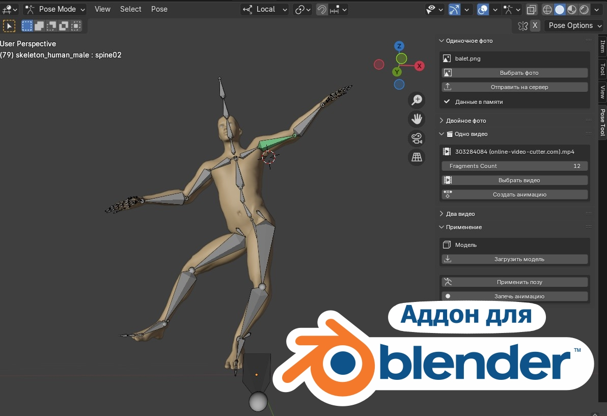
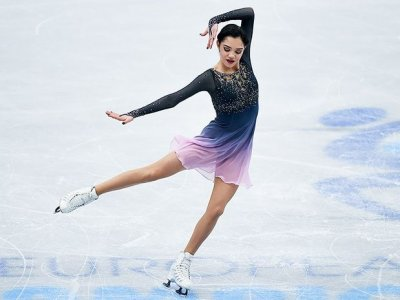
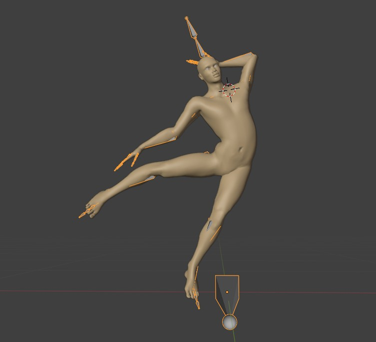
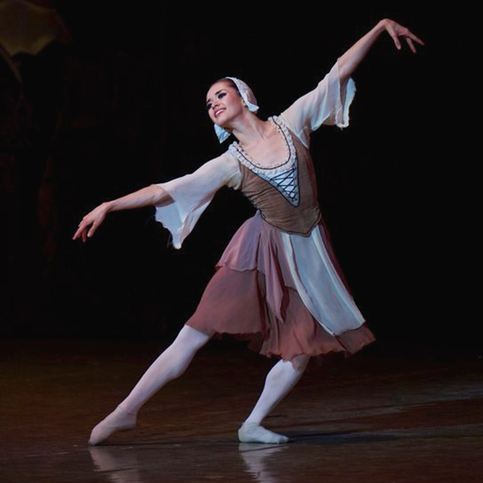
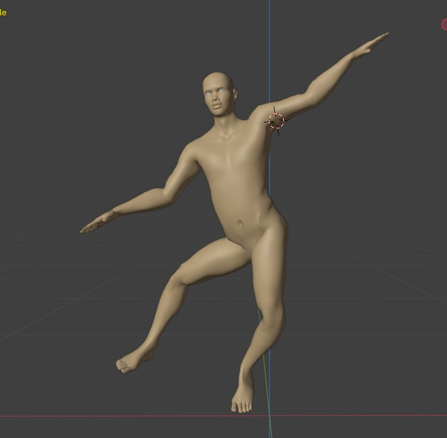
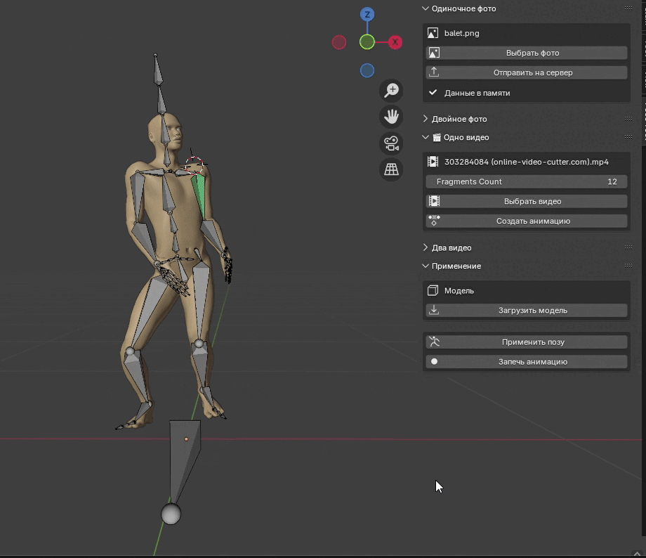

# Программный комплекс для цифровых художников, обеспечивающий автоматические позирование 3D персонажей на основе анализа фотографий и видеофайлов с использованием алгоритмов распознавания позы

Blender add-on для автоматического позирования 3D модели по фото, видео и в режиме реального времени

## Режимы работы

- Восстановление позы из 1 фото
- Восстановление позы из 2 фото
- Восстановление позы из 1 видео
- Восстановление позы из 2 видео
- Позирование в режиме реального времени

## Установка

Сервер запускается с помощью файла run_server.bat

Аддон устанавливается в Blender через 

Preferences -> Add-ons -> Install from Disk 
в формате .zip 
## Screenshots

| Референс | Результат |
|--|--|
|  |  |
|  |  |
|  |  |
